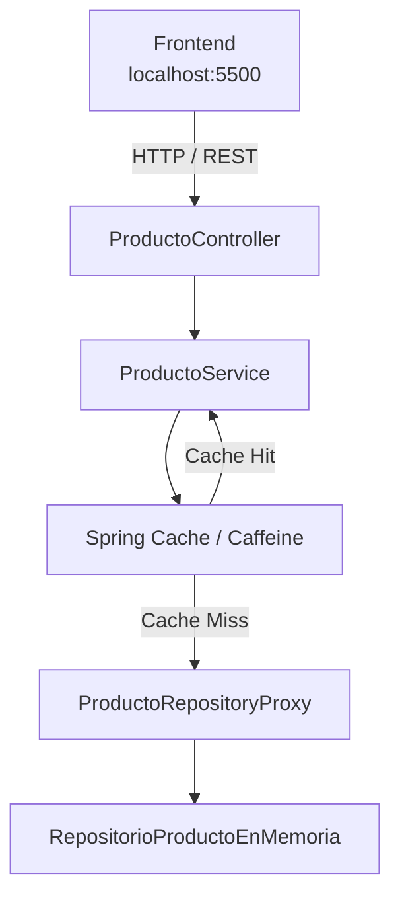

# ISWZ2202 — Catálogo de Productos

> Aplicación académica desarrollada con Java 17 y Spring Boot para demostrar una implementación práctica de caché, patrón Proxy, CORS e integración frontend–backend.

**Stack:** Java 17 · Spring Boot 3.3.4 · Spring Cache · Caffeine · REST API · HTML · CSS · JavaScript

---

## Descripción

Este proyecto implementa un catálogo de productos utilizando una arquitectura sencilla por capas.

La aplicación permite estudiar de forma práctica:

- Spring Cache.
- Caffeine como proveedor de caché en memoria.
- Patrón de diseño Proxy.
- Inyección de dependencias mediante interfaces.
- APIs REST.
- CORS en ambientes de desarrollo.
- Integración entre frontend y backend.
- Automatización del entorno desde VS Code.
- Debug de Spring Boot con F5.

El proyecto también incluye un frontend con una identidad visual **Luxury**, utilizando una paleta negra, blanca y dorada, animaciones CSS y mejoras progresivas mediante GSAP.

---

# Arquitectura

La aplicación mantiene separadas las responsabilidades de cada capa:



El flujo principal es:

```text
Frontend
   |
   | HTTP
   v
ProductoController
   |
   v
ProductoService
   |
   +--> Spring Cache
   |
   v
ProductoRepositoryProxy
   |
   v
RepositorioProductoEnMemoria
```

La caché y el Proxy se mantienen deliberadamente separados para que cada componente tenga una responsabilidad clara.

---

# Características principales

| Característica | Implementación |
|---|---|
| Backend | Java 17 + Spring Boot 3.3.4 |
| API | REST |
| Caché | Spring Cache + Caffeine |
| Proxy | Implementación explícita de `ProductoRepository` |
| Persistencia | Repositorio en memoria |
| Latencia simulada | 1,5 segundos |
| Frontend | HTML + CSS + JavaScript |
| CORS | Configuración específica para desarrollo |
| Debug | VS Code + F5 |
| Animaciones | CSS + GSAP / ScrollTrigger |
| Puertos | Frontend `5500` · Backend `8080` |

---

# Quick Start

## Requisitos

Antes de ejecutar el proyecto necesitas:

- Java 17.
- VS Code.
- Extension Pack for Java.
- Python 3.

No es necesario instalar Maven manualmente.

El proyecto incluye **Maven Wrapper**.

---

## Ejecutar la aplicación completa

Abre en VS Code la carpeta que contiene:

```text
pom.xml
```

Después:

1. Abre **Run and Debug**.
2. Selecciona:

```text
Aplicacion completa (Backend + Frontend)
```

3. Presiona:

```text
F5
```

VS Code ejecutará automáticamente:

```text
F5
 |
 +--> valida los puertos del entorno
 |
 +--> inicia el frontend en :5500
 |
 +--> inicia Spring Boot en Debug
 |
 +--> Spring Boot levanta :8080
 |
 +--> espera a que el backend esté disponible
 |
 +--> abre automáticamente el navegador
 |
 v
http://localhost:5500
```

No es necesario ejecutar comandos manuales para iniciar el entorno.

---

## Verificar servicios

Puedes comprobar los puertos desde PowerShell:

```powershell
Test-NetConnection localhost -Port 8080
Test-NetConnection localhost -Port 5500
```

En ambos casos deberías obtener:

```text
TcpTestSucceeded : True
```

---

# API REST

La API se ejecuta en:

```text
http://localhost:8080
```

## Obtener todos los productos

```http
GET /api/productos
```

Ejemplo:

```text
http://localhost:8080/api/productos
```

## Obtener producto por ID

```http
GET /api/productos/{id}
```

Ejemplo:

```text
http://localhost:8080/api/productos/1
```

---

# Implementación de Caché

La configuración se encuentra en:

```text
src/main/java/com/udla/arquitectura/demo/config/CacheConfig.java
```

Se utiliza **Caffeine** como implementación de caché en memoria.

Configuración principal:

| Parámetro | Valor |
|---|---:|
| Máximo de entradas | 100 |
| Expiración | 10 minutos |
| Estadísticas | Habilitadas |
| Cachés | `productos`, `productoPorId` |

La lógica de caché se aplica dentro de:

```text
ProductoService
```

mediante:

```java
@Cacheable
```

Las operaciones principales son:

```text
listarTodos()
    -> cache: "productos"
    -> key: "todos"

buscarPorId(id)
    -> cache: "productoPorId"
    -> key: id
```

También se utiliza:

```java
sync = true
```

Esto evita que varias peticiones idénticas ejecuten simultáneamente la misma operación lenta cuando todavía no existe una entrada en caché.

---

## Flujo sin caché

En la primera petición:

```text
Controller
   |
   v
ProductoService
   |
   v
Spring Cache
   |
   | CACHE MISS
   v
ProductoRepositoryProxy
   |
   v
RepositorioProductoEnMemoria
   |
   v
~1500 ms
```

El resultado se almacena posteriormente en Caffeine.

---

## Flujo con caché

En una petición posterior:

```text
Controller
   |
   v
ProductoService
   |
   v
Spring Cache
   |
   | CACHE HIT
   v
Respuesta
```

El Proxy y el repositorio real ya no necesitan ejecutarse.

---

# Patrón Proxy

El proyecto implementa explícitamente el patrón **Proxy**.

El contrato común es:

```text
ProductoRepository
```

Tanto el repositorio real como el Proxy implementan la misma interfaz.

```text
                  ProductoRepository
                         ^
                         |
              ProductoRepositoryProxy
                         |
                         v
             RepositorioProductoEnMemoria
```

La estructura utilizada por el Service es:

```text
ProductoService
      |
      v
ProductoRepository
      |
      v
ProductoRepositoryProxy
      |
      v
RepositorioProductoEnMemoria
```

`ProductoRepositoryProxy` está configurado como implementación principal mediante:

```java
@Primary
```

---

## Responsabilidad del Proxy

El Proxy agrega comportamiento alrededor del acceso al repositorio real sin modificar su implementación.

Entre sus responsabilidades se encuentran:

- interceptar llamadas;
- registrar operaciones;
- medir tiempos;
- delegar hacia el repositorio real;
- registrar errores;
- devolver el resultado original.

Ejemplo de logs:

```text
[PROXY] listarTodos -> acceso interceptado
[PROXY] listarTodos -> delegando al repositorio real
[REPOSITORY] listarTodos -> simulando consulta lenta
[PROXY] listarTodos -> respuesta recibida en 1500 ms
```

Si la siguiente petición se resuelve desde caché, estos mensajes no vuelven a aparecer.

---

# Cache vs Proxy

Ambos mecanismos cumplen responsabilidades diferentes.

| Componente | Responsabilidad |
|---|---|
| Spring Cache | Evitar operaciones repetidas |
| Caffeine | Almacenar temporalmente resultados |
| Proxy | Interceptar y controlar acceso al repositorio |
| Repository | Obtener los datos reales |

La caché **no está implementada dentro del Proxy**.

Esto mantiene una mejor separación de responsabilidades:

```text
Controller
   |
   v
Service + Cache
   |
   v
Proxy
   |
   v
Repository
```

---

# CORS

Durante desarrollo, frontend y backend funcionan en puertos diferentes:

```text
Frontend
http://localhost:5500

Backend
http://localhost:8080
```

Para el navegador estos son orígenes distintos.

La configuración se encuentra en:

```text
src/main/java/com/udla/arquitectura/demo/config/CorsConfig.java
```

Se habilitan únicamente los orígenes locales necesarios para desarrollo y los endpoints:

```text
/api/**
```

Flujo:

```text
localhost:5500
      |
      | fetch()
      v
localhost:8080/api/productos
```

---

# Frontend

El frontend está construido sin framework:

```text
HTML
CSS
JavaScript
```

Se encuentra en:

```text
frontend/
```

La interfaz utiliza una identidad visual Luxury basada en:

```text
Negro
Blanco / marfil
Dorado
```

Incluye:

- degradados;
- animaciones de entrada;
- microinteracciones;
- transiciones suaves;
- tarjetas interactivas;
- efectos hover;
- modal de producto;
- loader inicial;
- diseño responsive;
- motion basado en scroll.

También utiliza:

```text
GSAP
ScrollTrigger
```

mediante CDN para mejorar las animaciones.

Si las librerías externas no están disponibles, la aplicación continúa funcionando; únicamente se reducen algunos efectos visuales.

---

# Probar la caché

Una forma sencilla de demostrar el comportamiento es reiniciar primero la aplicación para vaciar la caché.

## Primera consulta

Abre:

```text
http://localhost:5500
```

La primera carga debería tardar aproximadamente:

```text
~1500 ms
```

debido a la latencia simulada del repositorio.

Después presiona:

```text
Recargar API
```

La nueva respuesta debería ser considerablemente más rápida.

---

## Probar desde PowerShell

También puedes medir las peticiones directamente:

```powershell
Measure-Command {
    Invoke-RestMethod http://localhost:8080/api/productos/1
}
```

Ejecuta el mismo comando dos veces.

Conceptualmente:

```text
Primera llamada
    |
    v
Cache MISS
    |
    v
Proxy
    |
    v
Repository
    |
    v
~1500 ms
```

Después:

```text
Segunda llamada
    |
    v
Cache HIT
    |
    v
respuesta inmediata
```

---

# Debug

El proyecto permite colocar breakpoints normalmente desde VS Code.

Por ejemplo, puedes seguir una petición colocando breakpoints en:

```text
ProductoController
        |
        v
ProductoService
        |
        v
ProductoRepositoryProxy
        |
        v
RepositorioProductoEnMemoria
```

Esto permite observar directamente cómo cambia el flujo cuando una petición se encuentra en caché.

---

# Ejecución manual

Aunque el flujo recomendado utiliza F5, los componentes también pueden ejecutarse manualmente.

## Backend — Windows

```powershell
.\mvnw.cmd spring-boot:run
```

## Backend — macOS / Linux

```bash
./mvnw spring-boot:run
```

## Frontend

```powershell
cd frontend
python -m http.server 5500
```

Después abre:

```text
http://localhost:5500
```

---

# Estructura del proyecto

```text
demo-app-estudiantes/
│
├── .vscode/
│   ├── launch.json
│   ├── tasks.json
│   ├── start-dev.ps1
│   ├── open-browser-when-ready.ps1
│   └── stop-dev.ps1
│
├── frontend/
│   ├── index.html
│   ├── styles.css
│   └── app.js
│
├── src/
│   └── main/
│       └── java/
│           └── com/
│               └── udla/
│                   └── arquitectura/
│                       └── demo/
│                           │
│                           ├── DemoApplication.java
│                           │
│                           ├── config/
│                           │   ├── CacheConfig.java
│                           │   └── CorsConfig.java
│                           │
│                           ├── controller/
│                           │   └── ProductoController.java
│                           │
│                           ├── model/
│                           │   └── Producto.java
│                           │
│                           ├── proxy/
│                           │   └── ProductoRepositoryProxy.java
│                           │
│                           ├── repository/
│                           │   ├── ProductoRepository.java
│                           │   └── RepositorioProductoEnMemoria.java
│                           │
│                           └── service/
│                               └── ProductoService.java
│
├── mvnw
├── mvnw.cmd
├── pom.xml
└── README.md
```

---

# Automatización de desarrollo

La configuración ubicada en:

```text
.vscode/
```

permite ejecutar la aplicación completa desde VS Code.

Los scripts administran:

```text
Frontend
   -> puerto 5500

Backend
   -> puerto 8080

Navegador
   -> apertura automática
```

El servidor de frontend se inicia desde la carpeta correspondiente al proyecto actual para evitar reutilizar accidentalmente otra instancia perteneciente a una copia diferente del repositorio.

Los archivos CSS y JavaScript también utilizan versionado durante desarrollo para reducir problemas provocados por la caché del navegador.

---

# Troubleshooting

## Puerto 8080 ocupado

Si aparece:

```text
El puerto 8080 ya esta ocupado
```

comprueba qué proceso lo está utilizando:

```powershell
Get-NetTCPConnection -LocalPort 8080 -State Listen
```

Puedes obtener información del proceso mediante:

```powershell
Get-Process -Id <PID>
```

---

## Puerto 5500 ocupado

Comprueba:

```powershell
Get-NetTCPConnection -LocalPort 5500 -State Listen
```

Si existe un servidor frontend antiguo, detenlo antes de iniciar otra copia del proyecto.

---

## Verificar puertos

```powershell
Test-NetConnection localhost -Port 8080
Test-NetConnection localhost -Port 5500
```

---

## El frontend muestra una versión anterior

Realiza una recarga completa del navegador:

```text
Ctrl + Shift + R
```

o:

```text
Ctrl + F5
```

---

# Conceptos demostrados

## Spring Cache

Reduce el costo de operaciones repetitivas almacenando temporalmente resultados previamente calculados.

## Caffeine

Proporciona una caché en memoria eficiente con límites, expiración y estadísticas.

## Proxy

Permite interceptar el acceso a otro objeto y agregar comportamiento sin modificar su implementación original.

## Dependency Inversion

`ProductoService` depende de:

```text
ProductoRepository
```

y no directamente de:

```text
RepositorioProductoEnMemoria
```

Esto reduce el acoplamiento entre capas.

## CORS

Permite que aplicaciones ejecutadas desde distintos orígenes se comuniquen de forma controlada durante desarrollo.

## Separation of Concerns

Cada componente mantiene una responsabilidad específica:

```text
Controller   -> HTTP
Service      -> lógica de aplicación + caché
Proxy        -> interceptación
Repository   -> acceso a datos
CORS         -> política de origen
Frontend     -> interfaz de usuario
```

---

# Puntos clave para la presentación

Durante la demostración se pueden explicar cuatro aspectos principales:

**1. Caché**

La primera consulta llega al repositorio y tarda aproximadamente 1,5 segundos. Las siguientes pueden responder directamente desde Caffeine.

**2. Proxy**

Cuando no existe caché, la operación pasa por `ProductoRepositoryProxy` antes de llegar al repositorio real.

**3. CORS**

El frontend se encuentra en `localhost:5500` y consume una API ubicada en `localhost:8080`.

**4. Automatización**

Todo el entorno de desarrollo puede iniciarse desde VS Code utilizando F5.

---

# Tecnologías

```text
Java 17
Spring Boot 3.3.4
Spring Web
Spring Cache
Caffeine
Maven
HTML5
CSS3
JavaScript
GSAP
ScrollTrigger
VS Code
Git / GitHub
```

---

## Proyecto académico

Desarrollado como práctica de **ISWZ2202** para reforzar conceptos de Java, Spring Framework, patrones de diseño e integración frontend–backend.
